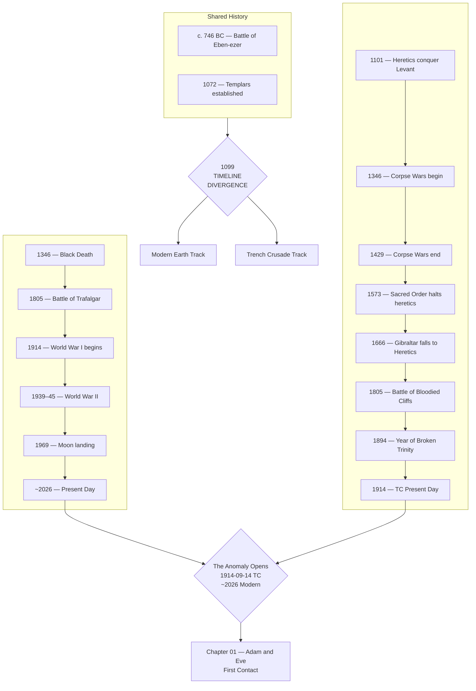

# Timeline

Time flows 1:1 across the Anomaly. The two worlds are offset by 112 years and approximately 12 hours — when it is morning in one, it is evening in the other.

## Diagram

| Year       | Modern Earth                                                 | Trench Crusade                                                                                                                                                            |
| ---------- | ------------------------------------------------------------ | ------------------------------------------------------------------------------------------------------------------------------------------------------------------------- |
| c. 746 BC  | Battle of Eben-ezer                                          | Battle of Eben-ezer                                                                                                                                                       |
| 1072       | Ominous celestial signs; Knights Templar established         | Ominous celestial signs; Knights Templar established                                                                                                                      |
| **1099**   | First Crusade captures Jerusalem. History proceeds normally. | **TIMELINE DIVERGENCE.** First Crusade captures Jerusalem. Knights Templar commit the Act of Ultimate Heresy. Gate of Hell opened. Jerusalem destroyed. Great War begins. |
| 1101       | —                                                            | Year of Three Battles. Heretics conquer most of the Levant.                                                                                                               |
| 1102       | —                                                            | Antioch fortified as the focal point of resistance.                                                                                                                       |
| 1106       | —                                                            | Cobar becomes first Tyrant of the Sixty-six.                                                                                                                              |
| 1109       | —                                                            | Iron Sultanate formed. Great Iron Wall fortified.                                                                                                                         |
| 1117       | —                                                            | Seventeen Martyrs captured and tortured in Brazen Bulls.                                                                                                                  |
| 1165       | —                                                            | Hashashins defend Alamut fortress.                                                                                                                                        |
| 1215       | —                                                            | Wars of Triclavianism begin. Church split.                                                                                                                                |
| 1306       | —                                                            | Wars of Triclavianism end.                                                                                                                                                |
| 1312       | —                                                            | First Communicants created. Battlefront stabilises.                                                                                                                       |
| **1346**   | Black Death ravages Europe                                   | Beelzebub unleashes the Black Grail. **Corpse Wars begin.** Tens of millions infected.                                                                                    |
| **1429**   | Joan of Arc's campaigns                                      | **Corpse Wars end.** Saint Jeanne d'Arc drives the Black Grail from mainland Europe.                                                                                      |
| 1477       | —                                                            | City of Argos taken by God.                                                                                                                                               |
| 1503       | —                                                            | Orichalcum steel formula discovered by War Prophet Angelos.                                                                                                               |
| 1545       | —                                                            | Antioch destroyed by infernal weapon.                                                                                                                                     |
| 1559       | —                                                            | Sword Congress of Vienna. New Antioch rebuilding begins.                                                                                                                  |
| 1573       | —                                                            | Sacred Order of the Dragon halts Heretic advance. Million heretics impaled at Wallachia.                                                                                  |
| 1588       | Spanish Armada                                               | Unified Church compiles the New Orthodox Syncretic Bible.                                                                                                                 |
| 1595       | —                                                            | Walls of New Antioch completed.                                                                                                                                           |
| 1607       | Jamestown founded                                            | —                                                                                                                                                                         |
| 1666       | Great Fire of London                                         | Year of Six Woes. Heretic fleet captures Gibraltar. Hell gains Atlantic access.                                                                                           |
| 1670       | —                                                            | England begins Fortress of the White Cliffs construction.                                                                                                                 |
| 1703       | —                                                            | Hebrew Knights destroy Templar stronghold at Acre.                                                                                                                        |
| 1721       | —                                                            | Third Siege of New Antioch lifted.                                                                                                                                        |
| 1776       | American Declaration of Independence                         | —                                                                                                                                                                         |
| 1789       | French Revolution                                            | Heretic Grand Fleet invades the Highlands.                                                                                                                                |
| **1805**   | Battle of Trafalgar                                          | **Battle of the Bloodied Cliffs.** Heretic fleet under High Captain Ranga defeats England. Admiral Nelson slain.                                                          |
| 1807       | —                                                            | Heretic Basilisk Fleet invades Éire.                                                                                                                                      |
| 1809       | —                                                            | Domus Demetrius constructed.                                                                                                                                              |
| 1865       | US Civil War ends                                            | Heraklion earthquake devastates Crete and the hellfront.                                                                                                                  |
| 1866       | —                                                            | Heretic scientists, aided by the demon Marbas, construct first submarines.                                                                                                |
| 1870       | —                                                            | Heretic submarine fleets extract heavy toll on merchant navies. Widespread famine.                                                                                        |
| 1872       | —                                                            | Heretic forces storm Rijeka. Conquest of European mainland launched.                                                                                                      |
| 1892       | —                                                            | Heretics expelled from Éire.                                                                                                                                              |
| 1894       | —                                                            | Year of Broken Trinity. Death Commandos assassinate Pope, High Prophetess, and Holy Roman Emperor.                                                                        |
| 1899       | —                                                            | Church Space Programme commences.                                                                                                                                         |
| 1905       | Einstein's Special Relativity                                | Supply Fleet of New Antioch destroyed. Eighth Siege of New Antioch begins.                                                                                                |
| 1907       | —                                                            | Moving Fortress of Britannia completed.                                                                                                                                   |
| 1908       | —                                                            | Battle of Vilnius — Heretic invasion driven back to Hellmouth.                                                                                                            |
| 1910       | —                                                            | Battle of Cordoba — bloody stalemate.                                                                                                                                     |
| **1914**   | **World War I begins** (Jul 28)                              | **TC Present Day.** Both sides prepare for major offensives.                                                                                                              |
| 1914-09-14 | Anomaly appears in North Atlantic. First contact. [[Chapter 01 – Adam and Eve]] | Anomaly appears in North Atlantic. First contact. [[Chapter 01 – Adam and Eve]]                                                                                                                         |
| 1914-09-15 | — | Inquisitor-Admiral Blackwood convenes war council at the [[Fortress of the White Cliffs]]. [[Holy Science Academy]] and [[Office of the Propagation of Virtue]] mobilised. First Faithful delegation crosses the threshold. [[Chapter 02 – The Inquisitor's Briefing]] |
| 1914-09-16 | — | First theological exchange: [[Father Beauchamp|Beauchamp]] and [[Daniel Foster|Foster]] debate the hidden God (*Deus Absconditus*). Beauchamp formulates the [[The Ark|Ark theology]] — Earth may be a preserved remnant. [[King Robert the Longsword|King Robert]] issues the Royal Decree of Hospitality. [[Rebecca Osei|Osei]] crosses the portal carrying [[Father Beauchamp|Beauchamp]]'s [[Orichalcum]] crucifix. [[Chapter 03 – Silence of Heaven]] |
| 1914-09-17 | [[Stephen Davenport|PM Davenport]] convenes first COBR meeting. [[Cautious Secular Engagement|CSE doctrine]] established: treat TC world as a foreign power, not a divine instrument. The ark question reversed — perhaps the TC world is the ark for the modern world. | [[Rebecca Osei|Osei]] meets [[King Robert the Longsword|King Robert]] in the Faithful London. First direct diplomatic exchange. [[Chapter 04 – Unsettling Question]] |
| 1914-09-18 | International community learns of portal via satellite. [[United States|US]] demands joint military command; [[France]] asserts [[UNCLOS]] jurisdiction; [[Germany]] constrained by Grundgesetz. [[NATO Headquarters|NATO]] session produces no resolution. | A cable arrives from the [[Principality of New Antioch|Office of the Propagation of Virtue]]: *Verify before you venerate.* The Faithful front fractures. A courier vessel departs south — the [[Iron Sultanate]] is watching. [[Chapter 05 – Gathering Storm]] |
| 1914-09-21 | The modern armada assembles at the portal: US, UK, French, Dutch, Norwegian, Spanish naval forces. [[USS Gerald R. Ford (CVN-78)|USS Gerald R. Ford]] arrives as the coalition hub. | The Faithful fleet reinforces the cordon. [[Alistair Pembroke|Pembroke]] receives the King's decree and the Office's warning simultaneously. [[Chapter 06 – The Order to Sail]] |
| 1914-09-23 | — | Formal parley at [[The Portal Threshold]]. Exchange of delegates: [[Bishop Aldric]] crosses to modern London; [[Malcolm Renfield]] crosses to the Faithful London. First extended contact begins. [[Chapter 07 – The Pilgrims]] |
| 1914-09-25 | [[Malcolm Renfield|Renfield]]'s report circulates — twelve pages forcing the coalition to confront the Crown's nature. Coalition fractures: [[James Hawthorne|Hawthorne]] argues the Crown cannot reform; [[Étienne Roussel|Roussel]] argues engagement without conditions is complicity. | [[Inquisitor Paulus|Inquisitor Paulus]] performs [[The Sifting]] on [[Rebecca Osei|Osei]] — finds presence, not taint; leaves without conclusion. [[Bishop Aldric]] meets [[Peter Chisholm|Archbishop Chisholm]] in modern London — a theological opening. [[King Robert's Letter]] delivered to [[Stephen Davenport|Davenport]]: the modern world is "an instrument of Providence." [[Chapter 08 – An Instrument of Providence]] |
| 1914-09-27 | [[Stephen Davenport|Davenport]] writes [[Davenport's Reply|his reply]] — refuses the Providence framing; offers friendship and concrete alliance. | [[Bishop Aldric]] returns carrying his [[The Theology of Waiting|theology of waiting]]. *[[USS Stout (DDG-55)|USS Stout]]* detects a [[The Heretic Submarine|Heretic submarine]] beneath the cordon. In the pursuit, *[[USS Stout (DDG-55)|Stout]]*'s bow tears into *[[HMS Resolute|HMS Resolute]]*'s port side. *[[USS Stout (DDG-55)|Stout]]* recovers and destroys the Heretic sub with a single Mk 54 torpedo — 31 seconds from launch to impact. [[Chapter 09 – Instruments and Witnesses]] |
| 1914-10-01 | "The collision was divine confirmation, not betrayal." Intel shows the Faithful Crown intensified its devotion. CIA analyst [[Marcus Webb]] proposes [[The Ark Strategy]]: let the Faithful's Providence theology stand uncorrected. [[Stephen Davenport|Davenport]] authorises the manipulation over French objections. | [[King Robert the Longsword|King Robert]], blind with faith, receives the summit invitation and reads it as Providence's next command. Overrules sceptics. Issues the summons — the [[Crown of England]] and the [[Iron Sultanate]] to a great council in the modern London. Couriers depart. [[Chapter 10 – The Providence We Cannot Claim]] |
| 1918       | World War I ends                                             | —                                                                                                                                                                         |
| 1939       | World War II begins                                          | —                                                                                                                                                                         |
| 1945       | Atomic age begins                                            | —                                                                                                                                                                         |
| 1969       | Moon landing                                                 | —                                                                                                                                                                         |
| 1991       | Cold War ends                                                | —                                                                                                                                                                         |
| 2001       | September 11 attacks                                         | —                                                                                                                                                                         |
| 2020       | COVID-19 pandemic                                            | —                                                                                                                                                                         |
| **~2026**  | **Modern Earth present day.** The Anomaly appears.           | Anomaly visible on this side as 1914-09-14.                                                                                                                               |
