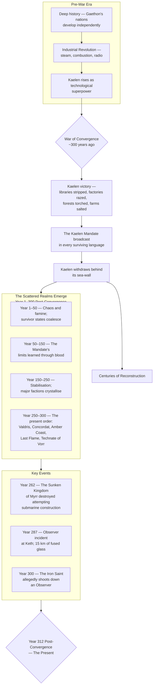

# Timeline of the Sundered World

## Diagram

## Detailed Chronology

| Year PC | Events |
|---------|--------|
| **Pre-0** | Gaethon's nations develop independently. Kaelen's technological acceleration begins — its isolated geography and mineral wealth fuel an industrial revolution unmatched anywhere on the planet. |
| **0** | **War of Convergence.** Kaelen wages total war against the combined forces of the continental powers. Radar-directed guns, monoplane bomber fleets, rocketry, and rumoured atomic fission decide the conflict. The last enemy army is broken within months. |
| **0** | **The Scouring.** Kaelen's forces strip libraries, museums, and universities of all scientific treatises, engineering blueprints, and advanced machinery. Forests are put to the torch, farms salted, foundries dismantled. The world is reduced to pre-industrial capability. |
| **0** | **The Kaelen Mandate** is broadcast in every surviving language. Kaelen withdraws behind its sea-wall. |
| **Year 1–20** | Global famine and collapse. An estimated 40–60% of the surviving population perishes. Small survivor states coalesce around remaining arable land and coastal fisheries. |
| **Year 20–50** | First major violations of the Mandate — early attempts at rebuilding forbidden technologies. Each is met with a precise ballistic missile strike. The lesson is learned: the Mandate is not a bluff. |
| **Year 50–150** | Gradual stabilisation. The first post-Convergence cities emerge. Steam and internal combustion industries restart at the permitted ceiling. Early vacuum-tube radio networks appear. |
| **Year 150–200** | The **[[Federated Crowns of Valdris]]** consolidate as a maritime power. The **[[Iron Concordat]]** forms in the Vorsteppes. The **[[Free Cities of the Amber Coast]]** establish their trade league. |
| **Year 200–250** | The **[[Theocratic Union of the Last Flame]]** rises in Oriens, codifying [[Pyricism]] as state doctrine. The **[[Technate of Vorr]]** entrenches in the Vorran Massif, pushing every boundary of the Edict. |
| **Year 262** | **The [[The Sunken Kingdom of Myrr|Myrr Incident]].** Myrr secretly constructs a submarine fleet in its deep fjords. A [[Silent Chorus]] drone identifies the heat bloom. Thirty-seven missiles turn the kingdom into a vitrified bay. Myrr becomes a lawless frontier. |
| **Year 287** | **The [[Keth]] Incident.** An [[The Observers|Observer]] is obstructed and harmed in the city of Keth. Retaliation creates a 15-kilometre radius of fused glass, still faintly radioactive. No further attempts to harm an Observer are recorded. |
| **Year ~300** | **The [[The Iron Saint|Iron Saint]]** legend is born. The Concordat folk-heroine allegedly shoots down an Observer with a howitzer shell and survives by detonating a cache of forbidden technology in her own camp, confusing the retaliatory strike. |
| **Year 312** | **The Present.** The Technate of Vorr tests a stratospheric meteorological airship near drone altitudes. The Concordat masses 200,000 troops on the Amber League's hinterland. Valdris debates a diplomatic mission to Kaelen. The Unbound believe they can decode the [[The Kaelic Melody|Kaelic Melody]]. |
