# AOT Timeline

## Diagram

```mermaid
flowchart TB
    subgraph ANCIENT["Ancient History"]
        A1["~1,800 yrs ago — Ymir Fritz<br/>acquires Titan powers"]
        A2["~1,700 yrs ago — Ymir dies;<br/>Nine Titans split"]
    end

    subgraph EMPIRE["Eldian Empire Era"]
        E1["~990 yrs — Eldia crushes Marley<br/>and exterminates nations"]
        E2["~100 yrs ago — Karl Fritz<br/>145th King retreats to Paradis"]
    end

    ANCIENT --> EMPIRE

    EMPIRE --> GTW{"Great Titan War<br/>~Year 743"}

    GTW --> WALLS["Karl Fritz builds the Walls<br/>Eldians memory-wiped<br/>Marley rises as hegemon"]

    subgraph WALL_ERA["Within the Walls (Year 743–850)"]
        W1["Year 825 — Grisha Yeager born"]
        W2["Year 835 — Eren Yeager born"]
        W3["Year 845 — Wall Maria falls<br/>Colossal/Armored breach Shiganshina"]
        W4["Year 847 — 104th Training Corps formed"]
    end

    WALLS --> WALL_ERA

    subgraph YEAR850["Year 850 — The Turning Point"]
        T1["Spring — Battle of Trost<br/>Eren's Titan power revealed"]
        T2["1 month later — 57th Expedition<br/>Female Titan captured"]
        T3["2 months later — Uprising<br/>Historia crowned Queen"]
        T4["4 months later — Battle of Shiganshina<br/>Beast/Armored/Colossal defeated<br/>Erwin Smith dies<br/>Armin inherits Colossal"]
    end

    WALL_ERA --> YEAR850

    YEAR850 --> POST["Post-Shiganshina<br/>Grisha's basement revealed<br/>Truth of the world known"]

    POST --> GATE{"The Gate Opens<br/>Modern Saturday evening<br/>Yellow Sea"}

    GATE --> CH1["Chapter 01<br/>First Contact"]
```

## Detailed Chronology

| Year | Events |
|------|--------|
| ~1,800 yrs ago | Ymir Fritz acquires the Power of the Titans from the Hallucigenia entity. |
| ~1,700 yrs ago | Ymir dies protecting King Fritz. Her corpse is consumed by her daughters Maria, Rose, and Sina. Nine Titans emerge. |
| ~990 yrs ago | Eldian Empire under King Fritz conquers Marley and decimates the world. Subjects of Ymir expand across the globe. |
| ~100 yrs ago | Karl Fritz, the 145th King, takes a contingent of Eldians to Paradis Island. Erects three concentric Walls (Maria, Rose, Sina) using millions of Colossal Titans. Wipes Eldian memories. Imposes Vow Renouncing War. |
| **Year 743** | **Great Titan War.** Eldian Empire collapses. Marley rises with Tybur family's aid. Wall cult established on Paradis. |
| Year 825 | Grisha Yeager born in Liberio, Marley. |
| Year 835 | Eren Yeager born in Shiganshina District. |
| Year 845 | **Wall Maria falls.** Colossal Titan and Armored Titan breach Shiganshina. Grisha passes the Attack and Founding Titans to Eren. |
| Year 847 | 104th Training Corps formed. |
| **Year 850** | |
| Spring | **Battle of Trost.** Eren's Titan ability revealed. Wall Rose breach sealed. |
| +1 month | **57th Exterior Scouting Mission.** Female Titan captured. Annie Leonhart crystalised. |
| +2 months | **Uprising Arc.** Royal government overthrown. Historia Reiss crowned Queen. Military junta under Premier Zachary established. |
| +4 months | **Battle of Shiganshina.** Survey Corps defeats Beast, Armored, and Colossal Titans. Erwin Smith dies. Armin Arlert inherits Colossal Titan. Survivors reach Grisha's basement. |
| Post-Shiganshina | The truth of the world is revealed: humanity survived beyond the walls. Eldians are a despised race. Marley controls seven of the Nine Titans and intends to conquer Paradis for resources. |
| **Saturday evening** | **The Gate opens on the Yellow Sea.** 500m wide, 200m tall portal connecting modern Earth to the AOT world's inverted ocean. South Korean Coast Guard secures; Chinese patrol intercepts. Standoff begins. |
